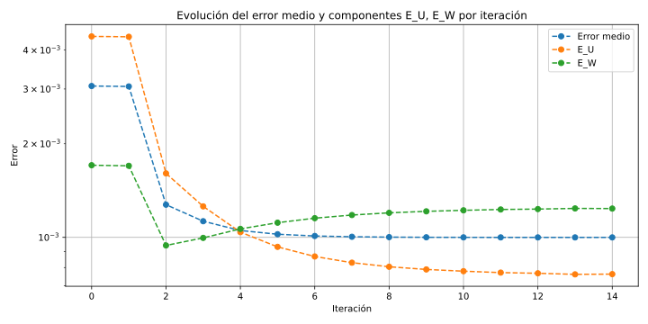
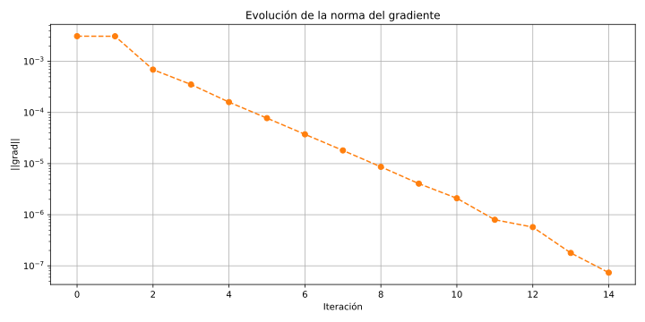
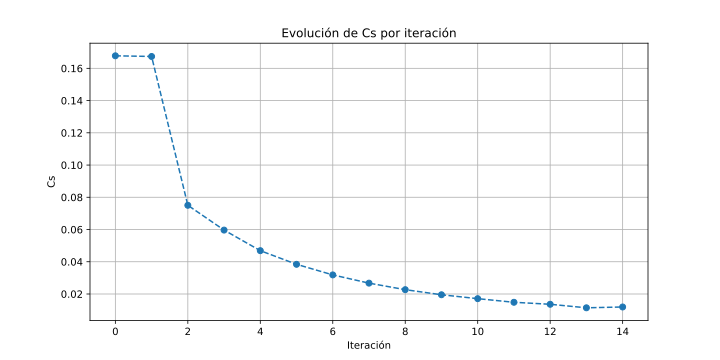
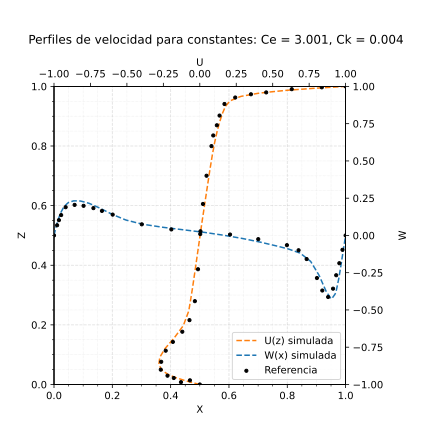
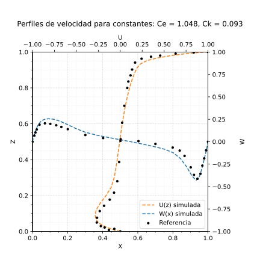

# Smagorinsky optimizer
---
## How to Use

1. **Set your simulation parameters:**

   - Edit the `caseData.json` file to define the desired configuration for your simulation.
   - It only accepts Reynolds of 3200 and 5000.
   - You can either keep the computed simulations or discard them at the end of the simulation.

2. **Run the simulation:**

   - Once configured, launch the simulation with:
     ```bash
     ./runCase.sh
     ```

---

## Virtual Environment Setup

You need to create a virtual environment in the project folder named `venv`, with the following Python packages installed:

```
numpy
scipy
matplotlib
pyvista
path
subprocess
os
classy_blocks
threading
tqdm
time
csv
json
pandas
re
shutil
```

> Some additional modules may be required. If you encounter import errors, make sure to install any missing packages with `pip`.

The environment activates automatically while running the bash script.

---

## Known Issues & Recommendations

While known bugs have been addressed, the program **might still crash** under certain conditions:

- **Smagorinsky constant > 2:**
  - This can lead to instability. Increasing the number of cells typically resolves this. Also, this can occur if the first jacobian aproximation (the identity for the moment) does not resemble the actual jacobian. Therefore, changes to the initialization of the algorithm are expected to be implemented in the near future.

- **Non-convergent cell size / timestep combination:**
  - Make sure your cell size and timestep are selected to ensure convergence and stability.

---

## Outputs

The program automatically generates a folder with the following information:
   - The evolution of the error with respect to the reference case.
   - The evolution of the gradient norm.
   - The evolution of the Smagorinsky constant.
   - The final velocity map at y = 0.5.
   - A map with all the run velocity profiles at y = 0.5 compared to the reference case.

---

#### Error


#### Gradient norm


#### Smagorinsky constant


#### Velocity map


#### Velocity profile comparison
 

---

## Disclaimer

The code is still under construction and changes and improvements may happen. 
